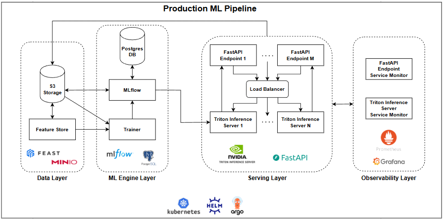
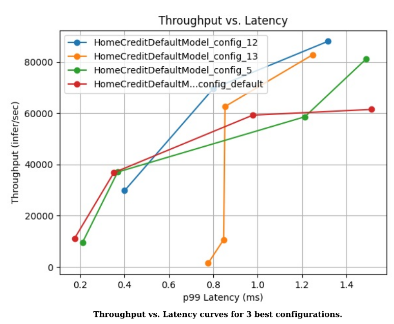
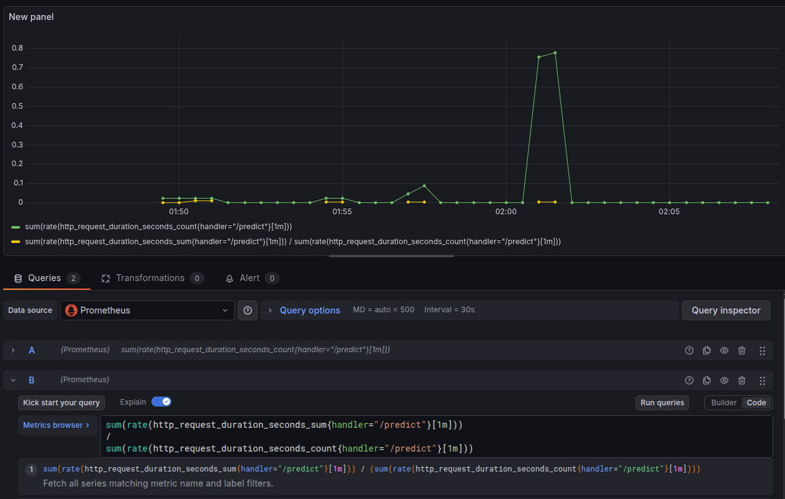
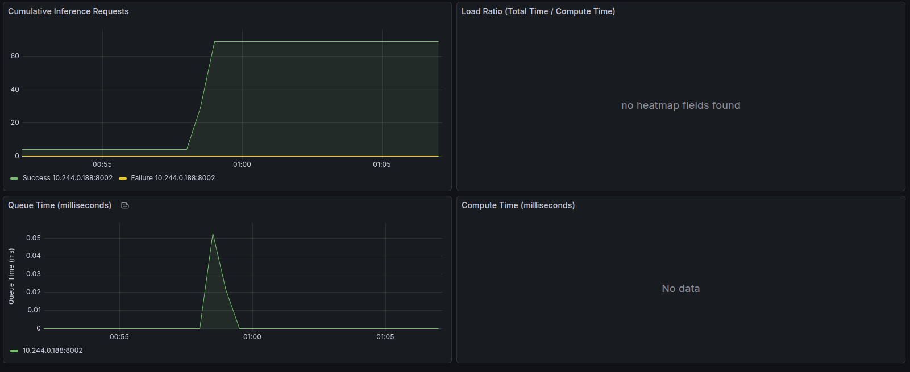
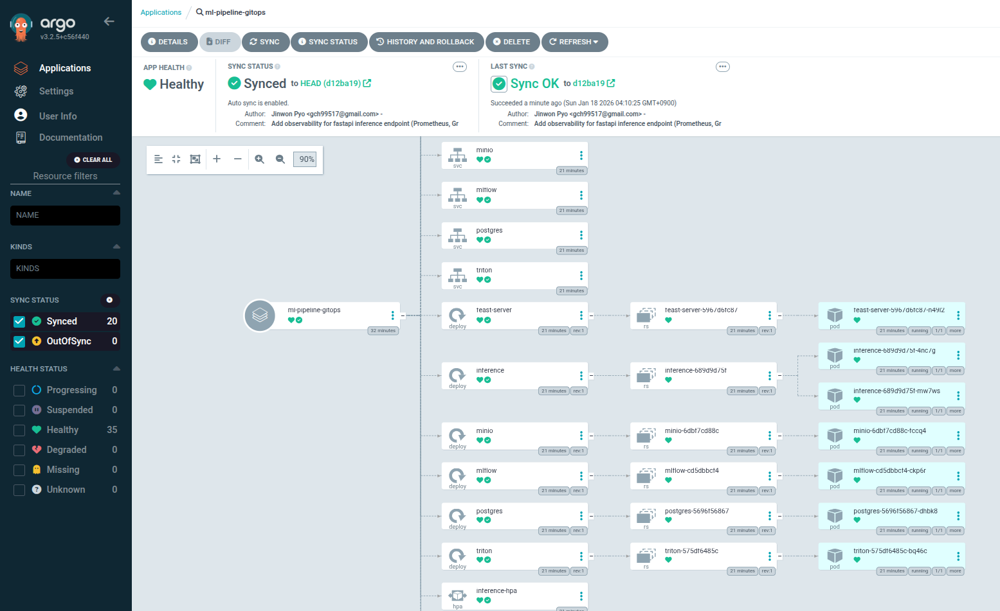

## 1. 프로젝트 개요
본 프로젝트는 데이터 수집부터 모델 학습, 성능 최적화, 그리고 안정적인 서빙 및 운영(GitOps)까지의 **End-to-End MLOps 파이프라인**을 구축하는 것을 목표로 합니다. 단순한 모델 배포를 넘어, **수직적 최적화(Triton Model Analyzer)** 와 **수평적 확장(K8s HPA)** 을 결합하여 자원 효율성과 시스템 가용성을 동시에 극대화한 실무 지향적 아키텍처를 지향합니다.

### 핵심 설계 목표
1. **데이터 일관성 확보**: Feature Store(Feast)를 도입하여 학습(Training)과 추론(Serving) 시점의 데이터 불일치(Training-Serving Skew) 방지
2. **비용 효율적 성능 최적화**: Triton Model Analyzer를 통해 하드웨어 제한 내 최적의 처리량(Throughput)을 내는 'Golden Config' 도출
3. **선형적 확장성 구현**: 최적화된 단일 Pod를 기반으로 클러스터 부하에 따라 유연하게 대응하는 선형적 확장 체계 구축
4. **인프라의 코드화(IaC) 및 자동화**: Helm과 ArgoCD를 활용하여 배포 과정을 표준화하고 Git 기반의 지속적 배포(CD) 실현

### 시스템 아키텍처


1. **Data Layer**: Feast (Feature Store) + MinIO (S3 compatible)
2. **ML Engine Layer**: Trainer + MLflow (Tracking/Registry) + Postgres (Metadata)
3. **Serving Layer**: Triton Inference Server (Core Engine) + FastAPI (BFF/Endpoint) + RabbitMQ (Broker) + Log Worker (Consumer)
4. **Infra & Ops Layer**: Kubernetes (EKS/Local), Helm, ArgoCD (GitOps)
5. **Observability Layer**: Prometheus + Grafana (ServiceMonitor)

### 핵심 기술 스택
- **Infrastructure**: Kubernetes, Docker, Helm, ArgoCD, RabbitMQ
- **Data/Feature**: Feast, MinIO (S3), PostgreSQL
- **Model Serving**: NVIDIA Triton Inference Server, FastAPI, Model Analyzer
- **ML Lifecycle**: MLflow (Tracking & Registry)
- **Observability**: Prometheus, Grafana

## 2. 상세 아키텍처 및 데이터 흐름
이 시스템은 데이터 소스로부터 추론 서비스까지 총 3단계의 파이프라인으로 구성됩니다.

### Data & Feature Pipeline (준비 단계)
- **Raw Data Ingestion**: 원천 데이터(CSV)를 **MinIO (S3)** 에 업로드하고, ```feature-store``` 컨테이너가 이를 읽어 Parquet 포맷으로 변환 후 오프라인 스토어(S3)에 저장합니다. 
- **Feature Management (Feast)**: 학습과 추론에 공통으로 사용될 FeatureView를 정의합니다. ```Materialize``` 과정을 통해 온라인 스토어(현재는 미사용)에 최신 데이터를 동기화하여 추론 시 저지연(Low-latency) 조회를 가능케 합니다. 

### Model Training & Lifecycle (학습 및 관리 단계)
- **Training**: Feast에서 ```get_historical_features```를 통해 정합성이 보장된 데이터셋을 추출하여 모델을 학습합니다. 관심사의 분리(Separation of Concerns) 원칙을 지키기위해 학습 Label은 Feature Store에 저장하지않고 S3에서 CSV 파일에서 직접 추출합니다.
- **Model Registry (MLflow)**: 학습된 모델은 **ONNX** 포맷으로 변환되어 관리합니다.
  - **Postgres (Backend Store)**: 하이퍼파라미터, 성능 메트릭, 모델 버전 등 **메타데이터** 저장
  - **MinIO (Artifact Store)**: 실제 모델 파일(```.onnx```)과 Triton 설정파일(```.pbtxt)```) 등 **대용량 파일** 저장  

### Inference & Serving (추론 및 피드백 단계)
- **Model Loading**: ```triton``` 컨테이너가 실행될 때 MLflow로부터 특정 버전(현재는 가장 최신버전)의 모델과 설정을 자동으로 다운로드하여 로드합니다.
- **Serving Hierarchy**:
  - **FastAPI (BFF)**: 외부 요청을 수신하고, Feast 온라인 스토어에서 필요한 Feature를 추출한 뒤 Triton으로 전달합니다.
  - **Triton Inference Server**: 고성능 엔진을 통해 실제 추론을 수행합니다.
  - **Asynchronous Logging (Feedback Loop):**
    - **RabbitMQ (Message Broker)**: FastAPI는 추론 결과를 응답함과 동시에 로그 데이터를 RabbitMQ의 Queue로 비동기 전송(Fire-and-Forget)합니다. 이를 통해 로깅 I/O가 추론 Latency에 영향을 주지 않도록 격리했습니다.
    - **Log Worker**: 별도의 Worker Pod이 큐에서 메세를를지르 소비하여 MinIO에 배치(Batch) 단위로 저장합니다. 이는 향후 모델 재학습 및 데이터 드리프트 분석의 기초자료로 활용됩니다.

## 3. 핵심 설계 의도
1. **ONNX 포맷 채택**: 특정 프레임워크(PyTorch, TF 등)에 종속되지 않고, Triton에서 최적화된 엔진(TensorRT 등)으로 변환하기 용이하기 때문입니다.
2. **BFF(FastAPI) 분리**: 비즈니스 로직(데이터 전처리, Feature 결합)과 순수 추론 로직(Triton)을 분리하여 **각각 독립적인 오토스케일링(HPA)** 이 가능하게 했습니다.
3. **비동기 로깅  아키텍처 (RabbitMQ + Worker)**: 추론 요청 처리(Critical Path)와 로그 저장(Non-critical Path)를 분리했습니다. MinIO(S3) 네트워크 지연이나 장애가 발생하더라도, 사용자에게 반환되는 추론 응답 속도에는 영향을 주지 않도록 **결합도(Decoupling)**을 낮췄습니다.
4. **Artifact & Metadata 분리**: 무거운 모델은 S3(MinIO)에, 가벼운 이력 정보는 RDB(Postgres)에 저장하여 데이터 처리 효율과 쿼리 성능을 모두 잡기위함 입니다.
5. **Feature Store 도입**: 학습시 사용한 Feature 계산 로직을 추론 시에도 그대로 재사용하여 **Training-Serving Skew** 문제를 차단하기위함 입니다.

## 4. 성능 최적화 전략 (Performance Optimization)
본 프로젝트는 추론 시스템의 효율성을 극대화하기 위해 **수직적 최적화(Vertical)** 와 **수평적 확장(Horizontal)** 을 결합한 2단계 전략을 취합니다. 자세한 사용 방법은 [benchmarks/triton_analysis/README.md](./benchmarks/triton_analysis/README.md) 를 참조바랍니다.

### 수직적 최적화: Triton Model Analyzer
단일 Pod(Container)내에서 하드웨어 자원을 최대로 활용할 수 있는 최적의 환경설정(Golden Config)를 도출합니다.

- **분석 방법**: Brute-force Grid Search를 자동화하여 다양한 설정 조합을 시뮬레이션합니다.
- **주요 탐색 파라미터:**
  - ```Max Batch Size```: 지연 시간 제약 내 최대 처리량 확보
  - ```Dynamic Batching Delay```: 요청을 모으는 최적의 대기 시간
  - ```Instance Group Count```: 동일 모델의 병렬 실행 개수
- **도출 결과**: 다양한 환경에서 시뮬레이션된 결과를 근거로 최적의 Latency와 Throughput을 보이는 최적의 환경설정(```config.pbtxt```)을 도출합니다.



### 수평적 확장: Kubernetes HPA (Horizontal Pot Autoscaler)
수직적으로 최적화된 단일 유닛(Pod)을 클러스터 단위로 확장하여 시스템 전체의 가용성과 자원 효율성을 극대화합니다.

- **선형적 확장성 (Linear Scalability)**: 
  - Triton Model Analyzer를 통해 단일 Pod의 성능 한계치(Golden Config)를 명확히 정의했기 때문에, 부하 증가시 Pod 수에 비례하여 시스템 전체 처리량이 선형적으로 증가할 것이라는 신뢰성을 확보하였습니다.
- **서비스 특성별 차등 스케일링 전략:**
  - **FastAPI Endpoint (BFF)**: 
    - 전형적인 **I/O Bound** 서비스입니다. 사용자 요청을 일차적으로 수용하고 외부 통신(Feast, Triton)을 중재해야 하므로 **2~10개**의 넓은 확장 법위를 설정했습니다. 
    - 스레드 풀(Thread Pool) 의존도를 낮추고 Event Loop을 활용함으로써, 최소한의 리소스로 높은 동시성(High Concurrency)과 처리량(Throughput)을 보장합니다. (```async```/```await``` 및 ```httpx``` 기반의 **Fully Asynchronous Non-blocking I/O** 아키텍처 구현). 또한, 로깅 작업을 **RabbitMQ로 위임**하여 I/O 블로킹이 생기지 않도록 하였습니다.
  - **Triton Server**: 고도의 연산이 필요한 **Compute Bound** 서비스입니다. C++ 기반 엔진으로 이미 최적화되어 있어 단일 유닛당 처리량이 높으므로, 리소스 효율을 위해 **1~5개**의 범위를 설정하였습니다.
- **로드 밸런싱:**
  - FastAPI와 Triton 사이에는 K8s Service (ClusterIP)가 간단한 로드밸런서(L4 수준) 역할을 수행합니다. 예를 들어 10개의 FastAPI Pod에서 발생하는 요청을 5개의 Triton Pod로 적절히 분산시켜, 각 Triton Pod가 분석된 최적 부하 범위 내에서 동작하도록 유도합니다.

## 5. 관측성: 모니터링 기반 구축 (Observability)
시스템의 안정적인 운영과 투명한 성능 관리를 위해, 언제든 상세 모니터링이 가능하도록 **Prometheus + Grafana** 기반의 관측성 체계를 구축했습니다.

### 모니터링 인프라
- **ServiceMonitor 활용**: Prometheus Operator의 ```ServiceMonitor```를 사용하여 쿠버네티스 네이티브한 방식으로 메트릭 수집을 자동화했습니다.
- **Endpoint 개방:**
  - **FastAPI**: 서비스 상태와 요청 처리량을 모니터링하기 위한 메트릭 엔드포인트 구축
  - **Triton Inference Server**: Triton이 자체 제공하는 상세 메트릭(Latency, Throughput, GPU/CPU 이용률 등)을 수집할 수 있도록 포트를 개방하였습니다. 

  
  **FastAPI Metric Dashboard**

  
  **Triton Inference Server Metric Dashboard**

  ## 6. 배포 자동화: GitOps (Helm + ArgoCD)
  본 프로젝트는 수많은 마이크로서비스(7개의 컨테이너)를 효율적으로 관리하고, 인프라 상태를 코드와 동일하기 유지하기 위해 **GitOps** 패턴을 채택했습니다.

  ### Helm: Kubernetes Orchestration
  쿠버네티스 리소스를 개별 YAML 파일로 관리하는 대신, **Helm Chart**를 활용해 패키징하고 표준화했습니다.

  - **템플릿 엔진 활용**: Kustomize와 달리 강력한 **Template 방식**을 지원하는 Helm을 사용하여, ```value.yaml``` 설정만으로 각 환경(개발/프로덕션)에 맞는 리소스(CPU, Memory, Replicas)를 유연하게 주이할 수 있도록 설계했습니다.
  - **컴포넌트 통합 관리**: ```feature-store```, ```triton```, ```fastapi``` 등 서로 연관된 서비스들을 하나의 Chart에서 관리하여 배포 의존성을 명확히 했습니다.

  ### ArgoCD: Continous Delivery
  Git 저장소를 **Single Source of Truth**로 삼아 선언적 배포를 하였습니다.

  - **Desired State 관리**: Git에 정의된 상태(Desired State)와 실제 클러스터 상태(Actual State)를 ArgoCD가 실시간으로 감시하며 동기화합니다.
  - **배포 가시성**: ArgoCD 대시보드를 통해 전체 파이프라인의 배포 상태를 시각적으로 모니터링하고, 문제 발생 시 즉각적인 **롤백(Rollback)** 이 가능한 운영 환경을 구축했습니다.
  - **자동화된 동기화**: ```argocd-app.yaml```을 통해 Git 저장소의 변경사항을 감지하여 수동 개입 없이 클러스터에 반영되는 자동화 파이프라인을 구축하였습니다.
  - **Pull 방식의 장점**: 전통적인 Jenkins/Github Actions 기반의 Push 방식 배포는 클러스터 내부의 실제 상태를 알기가 어렵습니다. 반면 ArgoCD와 같은 **Pull 방식**은 클러스터가 스스로 Git과 동기화하기 때문에 배포의 신뢰성이 훨씬 높습니다.

  
  **ArgoCD Dashboard**

## 7. Helm + ArgoCD 실행 방법

### 데이터 준비 
[Kaggle - Home Credit Default Risk](https://www.kaggle.com/competitions/home-credit-default-risk/overview)에서 **application_{train|test}.csv**와 **bureau.csv** 파일을 다운받아 **./data**에 저장. 대략적으로 350MB 필요.

### 사전 준비
- Docker 설치 (Docker Engine Version 28.2.2)
- Kubernetes 설치 (Client Version: v1.35.0, Kustomize Version: v5.7.1, Server Version: v1.30.14)
- Kubeadm 설치 (GitVersion: v1.30.14)
- Helm 설치 (Version: v4.0.5)
- Kubernetes metrics-server 설치 (HPA을 하기위해 필요)
  ```sh
  $ kubectl apply -f https://github.com/kubernetes-sigs/metrics-server/releases/latest/download/components.yaml
  ```
- [Prometheus 설치](./observability/README.md)
- [ArgoCD 설치](./argocd/README.md)


### 실행 방법
1. 실행에 필요한 도커 이미지 빌드 및 도커허브에 업로드
    ```sh
    $ ./build_and_push_images.sh
    ```
2. ArgoCD 실행
    ```sh
    $ kubectl apply -f argocd/argocd-app.yaml
    ```

### 추론 요청 예시
단일 요청 (IP는 "```$ hostname -I```" 명령어를 통해 확인)
```sh
curl -X POST http://x.x.x.x:30080/predict \
  -H "Content-Type: application/json" \
  -d '{
    "AMT_INCOME_TOTAL": 50000,
    "AMT_CREDIT": 200000,
    "AMT_ANNUITY": 15000,
    "DAYS_BIRTH": -12000,
    "DAYS_EMPLOYED": -2000,
    "bureau_credit_count": 3,
    "bureau_credit_active_count": 1,
    "bureau_credit_days_enddate_mean": -500,
    "bureau_amt_credit_sum": 300000,
    "bureau_amt_credit_sum_overdue": 0
  }'
```
배치 요청 (IP는 "```$ hostname -I```" 명령어를 통해 확인)
```sh
curl -X POST http://x.x.x.x:30080/predict/batch \
  -H "Content-Type: application/json" \
  -d '[
    {
      "AMT_INCOME_TOTAL": 50000,
      "AMT_CREDIT": 200000,
      "AMT_ANNUITY": 15000,
      "DAYS_BIRTH": -12000,
      "DAYS_EMPLOYED": -2000,
      "bureau_credit_count": 3,
      "bureau_credit_active_count": 1,
      "bureau_credit_days_enddate_mean": -500,
      "bureau_amt_credit_sum": 300000,
      "bureau_amt_credit_sum_overdue": 0
    },
    {
      "AMT_INCOME_TOTAL": 80000,
      "AMT_CREDIT": 300000,
      "AMT_ANNUITY": 20000,
      "DAYS_BIRTH": -14000,
      "DAYS_EMPLOYED": -4000,
      "bureau_credit_count": 5,
      "bureau_credit_active_count": 2,
      "bureau_credit_days_enddate_mean": -800,
      "bureau_amt_credit_sum": 500000,
      "bureau_amt_credit_sum_overdue": 1000
    }
  ]'
```